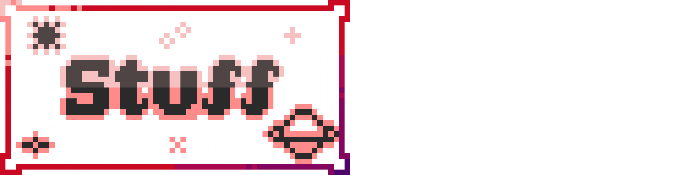

# BrotherEarth967

HOME · [TH VERSION](index-th.html) · [FAQ](/faq) · [CONTACT ME](/contact)

Hi! My name's BrotherEarth967! o/

## About Me
* I am a [Minecraft Resource Pack Artist](https://planetminecraft.com/member/brotherearth967_-ve/)
* I am very occasionally not completely terrible at videogames
* I'm interested in far too many þings for my own good, so I ought to share some of þese tidbits to get þem off of my metaphorical chest!
* Minecraft is cool, Modded Minecraft is cooler

---

---

* Check out þese modular Resource Pack pickers: [Vanilla Extract](https://vanilla-extract.tk), [Vanilla Tweaks](https://vanillatweaks.net), [Little Improvements](http://littleimprovements-custom.tk/)
* [*#StopModReposts*](https://stopmodreposts.org): Do your bit against Minecraft Mods being maliciously reposted!
* [*#StopStevee*](stop-steveee): Learn about stopping "Steveee", a malevolent Minecraft YouTuber profiting off oþers' creations!
* What does Þ or þ mean? Find out on [Wikipedia](https://wikipedia.org/wiki/Thorn_(letter)) or [*#BringBackÞorn*](https://reddit.com/r/bringbackthorn), and press þe 'TH VERSION' button at þe top of most pages (Not þis one; it's out of principle, you see…) to get rid of þem. Not þat any respectable person would ever want to do þat…
